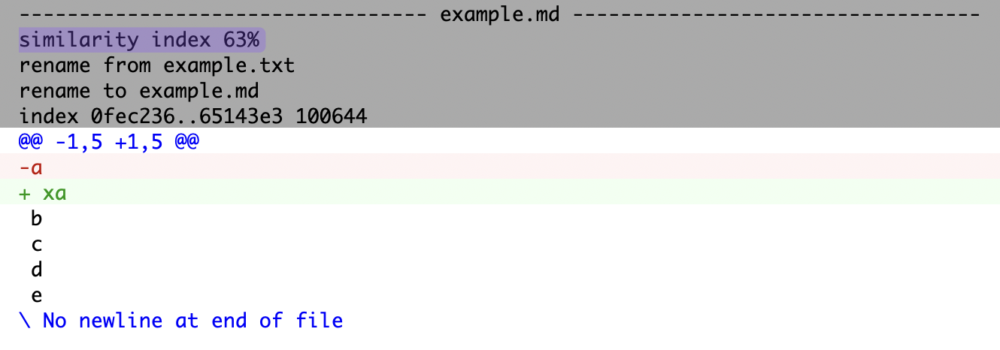

# git-similarity-index

[](#cli)
[](https://www.npmjs.com/package/git-similarity-index)
[](https://badge.fury.io/js/git-similarity-index)
[](https://www.npmjs.com/package/git-similarity-index)
[](https://packagephobia.com/result?p=git-similarity-index)
[](https://piecioshka.mit-license.org)
[](https://github.com/piecioshka/git-similarity-index/actions/workflows/testing.yml)

🔨 Calculates the similarity index between two files.

## Motivation

I would like to calculate the similarity between two files. Unfortunately, but Git does not provide a command that would count the ‘similarity index’. Therefore, I decided to write such a tool myself that counts this index.



## CLI

```bash
npm install -g git-similarity-index

git-similarity-index mocks/file1.txt mocks/file2.txt
# or
git-similarity-index mocks/file1.txt mocks/file2.txt --use-git
```

## Usage

### `getSimilarityIndex` + `getLinesBytes`

```js
import { getSimilarityIndex, getLinesBytes } from "git-similarity-index";

(function () {
  const toBytes = (text) => Buffer.from(text).toJSON().data;

  const firstPattern = "a\n";
  const secondPattern = "a\nb";
  const similarityIndex = getSimilarityIndex(
    getLinesBytes(toBytes(firstPattern)),
    getLinesBytes(toBytes(secondPattern)),
    toBytes(secondPattern).length,
  );
  console.log(similarityIndex); // 66.67
})();
```

### `getSimilarityIndexForText`

```js
import { getSimilarityIndexForText } from "git-similarity-index";

(function () {
  const firstPattern = "a\nb\nc\n";
  const secondPattern = "a\nb\nc\nd";
  const similarityIndex = getSimilarityIndexForText(
    firstPattern,
    secondPattern,
  );
  console.log(similarityIndex); // 85.71
})();
```

### `getSimilarityIndexForFiles`

```js
import { getSimilarityIndexForFiles } from "git-similarity-index";

(async function () {
  const similarityIndex = await getSimilarityIndexForFiles(
    "mocks/file1.txt",
    "mocks/file2.txt",
  );
  console.log(similarityIndex); // 46.34
})();
```

### `getSimilarityIndexForFiles` (with `useGit` option)

```js
import { getSimilarityIndexForFiles } from "git-similarity-index";

(async function () {
  const similarityIndex = await getSimilarityIndexForFiles(
    "mocks/file1.txt",
    "mocks/file2.txt",
    { useGit: true },
  );
  console.log(similarityIndex); // 46.34
})();
```

## Debug

The tool itself uses the `debug` library. You can enable debugging by setting the `DEBUG` environment variable.

```bash
# to display all logs
DEBUG=git-similarity-index:* git-similarity-index mocks/file1.txt mocks/file2.txt

# focus only of bytes
DEBUG=git-similarity-index:bytes git-similarity-index mocks/file1.txt mocks/file2.txt

# focus only of text
DEBUG=git-similarity-index:text git-similarity-index mocks/file1.txt mocks/file2.txt

# focus only of files
DEBUG=git-similarity-index:files git-similarity-index mocks/file1.txt mocks/file2.txt
```

## License

[The MIT License](https://piecioshka.mit-license.org) @ 2024
